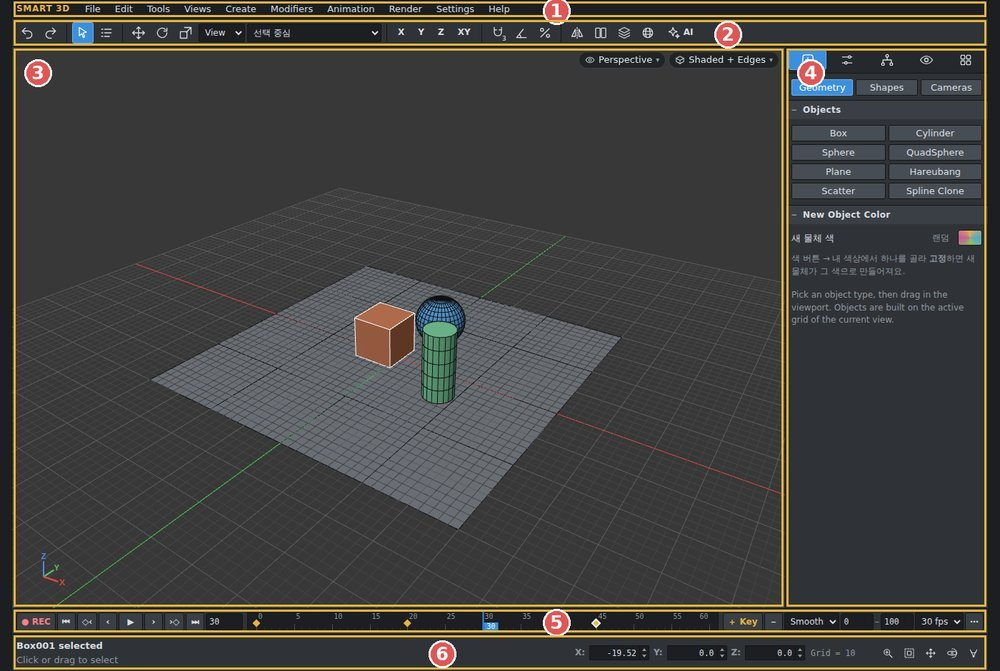
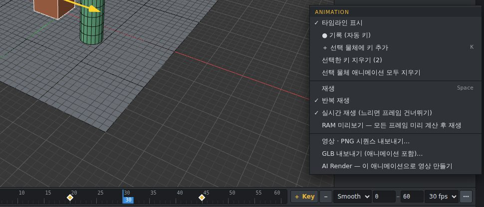
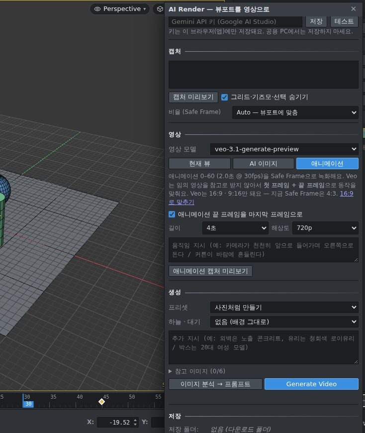

# SMART 3D

**[English](README_EN.md)** · 한국어

웹 기반 3D 모델링 도구 — 모델링, 애니메이션, AI 이미지·영상 렌더링을 한 프로그램에서.
설치 없이 실행되는 **Windows 프로그램(SMART3D.exe)** 과 브라우저에서 여는 **HTML 버전**을 무료로 제공합니다.

## 다운로드

**[⬇ Releases 페이지에서 받기](https://github.com/xxxxskyxxx/SMART-3D/releases/latest)**

| 파일 | 언어 | 설명 |
|---|---|---|
| `SMART3D_KO_v1.1.exe` | 한국어 | Windows 실행 파일 — 더블클릭으로 바로 실행 (설치 필요 없음) |
| `SMART3D_EN_v1.1.exe` | English | Windows executable (English UI) |
| `SMART-3D_KO_v1.1_html.zip` | 한국어 | 브라우저(Chrome·Edge)에서 여는 HTML 버전 + 도움말 |
| `SMART-3D_EN_v1.1_html.zip` | English | HTML version (English UI) + help |

> **처음 실행할 때** Windows가 “PC 보호” 창을 띄우면 **추가 정보 → 실행**을 누르세요. (코드 서명 인증서가 없는 개인 배포 프로그램이라 나오는 안내입니다.)

## 주요 기능

- **모델링** — 기본 도형·스플라인, Modify Poly / Modify Spline 편집(Extrude, Inset, Bevel, Chamfer, Bridge 등), 모디파이어 스택(Multi Select, Projection Spline, Pattern 표면 타일링(삼각·사각·육각), Shell, Noise …), Boolean, Mirror, SMART Utils ▸ Drop Surface
- **복사** — Shift+드래그 후 개수 지정: 원본과 복사본 사이 채우기 / 같은 간격으로 더 만들기
- **재질** — 재질 편집기(M), 텍스처, 요소별 Random 매핑, Color correct
- **카메라** — 실내·실외·제품 프리셋, 2점 투시(수직 보정), Safe Frame 비율
- **애니메이션** — 타임라인, ● REC 자동 키, 이동·회전·크기·파라미터·카메라 키, 키 드래그 다중 선택·이동·복사, RAM 미리보기
- **가져오기 · 내보내기** — File ▸ Import… / Export… 창에서 형식 선택: GLB(애니메이션 포함) · FBX · OBJ · STL · PLY, 영상(MP4/WebM) · PNG 시퀀스
- **AI Render** — 이미지와 영상을 한 창에서
  - Google Gemini(이미지) · **Google Veo(영상)**
  - **Higgsfield API**(키) · **Higgsfield 로그인**(구독 크레딧, exe 전용) — 모델 목록 자동 로드
  - 애니메이션 캡처(첫·끝 프레임 + 참고 영상)로 AI 영상 만들기, 전/후 비교, 뷰포트 겹쳐 보기

| 애니메이션 | AI 영상 |
|---|---|
|  |  |

## 도움말

- 프로그램 안: **Help ▸ 기능 가이드 (그림 도움말)** · 단축키 목록 **F1**
- 따로 보기: [docs/SMART3D_도움말.html](docs/SMART3D_도움말.html) (다운로드 후 브라우저로 열기)

## 시스템 요구 사항

- **exe**: Windows 10 / 11 (64비트)
- **HTML**: 최신 Chrome 또는 Edge (WebGL 2)
- AI 기능은 인터넷 연결과 각 서비스의 본인 계정·API 키가 필요합니다.

## AI 서비스 이용 안내

- API 키와 로그인 정보는 **사용자 PC에만 저장**되며 SMART 3D 개발자에게 전송되지 않습니다.
- 생성 비용(크레딧)과 이용 조건은 각 서비스(Google, Higgsfield)의 약관을 따릅니다.
- Higgsfield API 키(open.higgsfield.ai)와 Higgsfield 계정 로그인(higgsfield.ai)은 서로 다른 서비스입니다. 계정 로그인은 **exe 버전에서만** 됩니다.

## 라이선스

**프리웨어** — 개인·상업 작업 모두 무료로 사용할 수 있습니다. 프로그램으로 만든 결과물은 사용자의 것입니다.
프로그램 자체의 판매, 수정·재배포, 역설계는 허용되지 않습니다. 자세한 내용은 [LICENSE.md](LICENSE.md)를 보세요.

사용한 오픈소스: [THIRD_PARTY_LICENSES.md](THIRD_PARTY_LICENSES.md) (three.js, three-bvh-csg, three-mesh-bvh, Electron — MIT)

3ds Max는 Autodesk, Inc.의 상표이며, SMART 3D는 Autodesk와 관계없는 독립 제품입니다. Google, Gemini, Veo, Higgsfield, Claude(Anthropic)는 각 소유자의 상표입니다.

## 만든 이야기

SMART 3D는 제가 3D 모델링 작업과 AI 렌더링에 직접 쓰려고, AI 코딩 도구인 Claude(Anthropic)와 함께 만든 개인 프로젝트입니다. 기획과 테스트는 제가 하고, 코드는 Claude와 대화하며 만들었습니다. SMART 3D는 Anthropic과 관계없는 독립 프로그램입니다.

## 만든 사람

**xxxsky** · YouTube [joycg](https://youtube.com/joycg) · [네이버 카페](https://cafe.naver.com/xxxsky)
