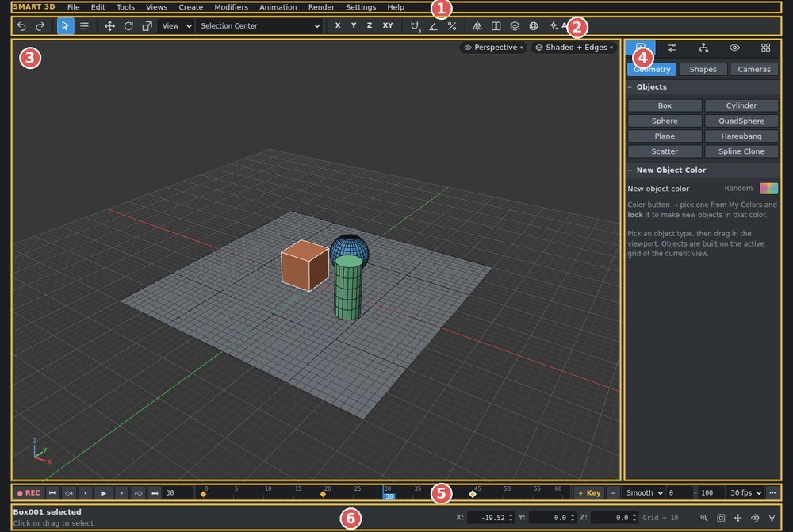
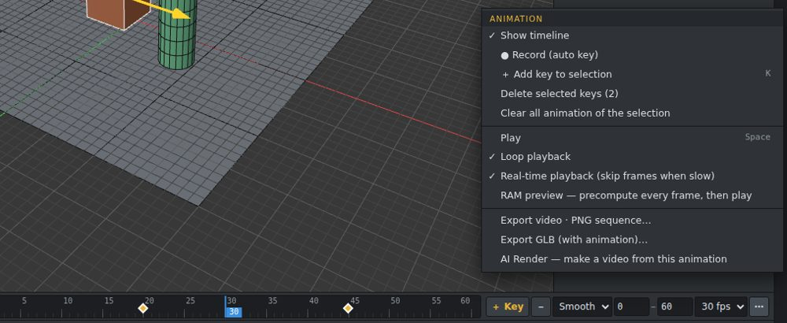
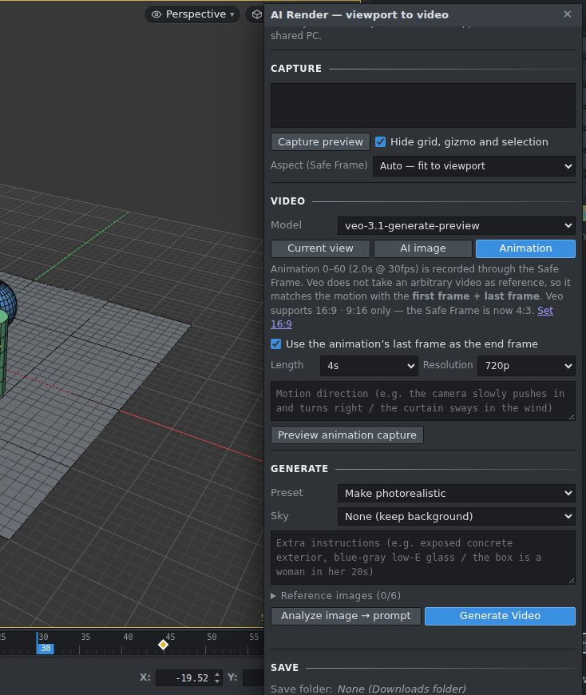

# SMART 3D

English · **[한국어](README.md)**

A web-based 3D modeling tool — modeling, animation and AI image / video rendering in one program.
Free to use as a **Windows program (SMART3D.exe)** that runs without installation, or as an **HTML version** that opens in your browser.

## Download

**[⬇ Get it from the Releases page](https://github.com/xxxxskyxxx/SMART-3D/releases/latest)**

| File | Language | Description |
|---|---|---|
| `SMART3D_EN_v1.1.exe` | English | Windows executable — double-click to run (no installation) |
| `SMART3D_KO_v1.1.exe` | Korean | Windows executable (Korean UI) |
| `SMART-3D_EN_v1.1_html.zip` | English | HTML version for Chrome / Edge + help |
| `SMART-3D_KO_v1.1_html.zip` | Korean | HTML version (Korean UI) + help |

> **First run:** if Windows shows “Windows protected your PC”, click **More info → Run anyway**. (It appears because this independent program is not code-signed.)

## Features

- **Modeling** — primitives and splines, Modify Poly / Modify Spline editing (Extrude, Inset, Bevel, Chamfer, Bridge…), modifier stack (Multi Select, Projection Spline, Pattern surface tiling (tri · quad · hex), Shell, Noise…), Boolean, Mirror, SMART Utils ▸ Drop Surface
- **Copy** — Shift+drag, then set a count: fill between original and copy / more at the same spacing
- **Materials** — Material Editor (M), textures, Random mapping per element, Color correct
- **Cameras** — Interior / Exterior / Product presets, 2-point perspective (vertical correction), Safe Frame ratios
- **Animation** — timeline, ● REC auto key, keys for move · rotate · scale · parameters · cameras, box-select / move / copy keys, RAM preview
- **Import · Export** — pick a format in File ▸ Import… / Export…: GLB (with animation) · FBX · OBJ · STL · PLY, video (MP4/WebM) · PNG sequence
- **AI Render** — images and videos in one window
  - Google Gemini (image) · **Google Veo (video)**
  - **Higgsfield API** (key) · **Higgsfield Login** (plan credits, exe only) — model lists load automatically
  - AI video from the animation capture (first / last frame + reference clip), before/after compare, viewport overlay

| Animation | AI video |
|---|---|
|  |  |

## Help

- In the program: **Help ▸ Feature guide (with pictures)** · hotkey list **F1**
- Separately: [docs/SMART3D_Help_EN.html](docs/SMART3D_Help_EN.html) (download and open in a browser)

## Requirements

- **exe**: Windows 10 / 11 (64-bit)
- **HTML**: current Chrome or Edge (WebGL 2)
- AI features need an internet connection and your own account / API key for each service.

## About the AI services

- API keys and login tokens are **stored only on your PC** and are never sent to the SMART 3D developer.
- Generation costs (credits) and terms of use are those of each service (Google, Higgsfield).
- A Higgsfield API key (open.higgsfield.ai) and a Higgsfield account login (higgsfield.ai) are different services. Account login works **in the exe only**.

## License

**Freeware** — free for personal and commercial work. Everything you create with the program is yours.
Selling, modifying / redistributing or reverse-engineering the program itself is not allowed. See [LICENSE.md](LICENSE.md).

Open-source components: [THIRD_PARTY_LICENSES.md](THIRD_PARTY_LICENSES.md) (three.js, three-bvh-csg, three-mesh-bvh, Electron — MIT)

3ds Max is a trademark of Autodesk, Inc. SMART 3D is an independent product, not affiliated with Autodesk. Google, Gemini, Veo, Higgsfield and Claude (Anthropic) are trademarks of their respective owners.

## About this project

I built SMART 3D as a personal project for my own 3D modeling and AI rendering work, together with Claude (Anthropic), an AI coding assistant. I did the planning and testing, and the code was written through conversations with Claude. SMART 3D is an independent program and is not affiliated with Anthropic.

## Author

**xxxsky** · YouTube [joycg](https://youtube.com/joycg) · [Naver Cafe](https://cafe.naver.com/xxxsky)
